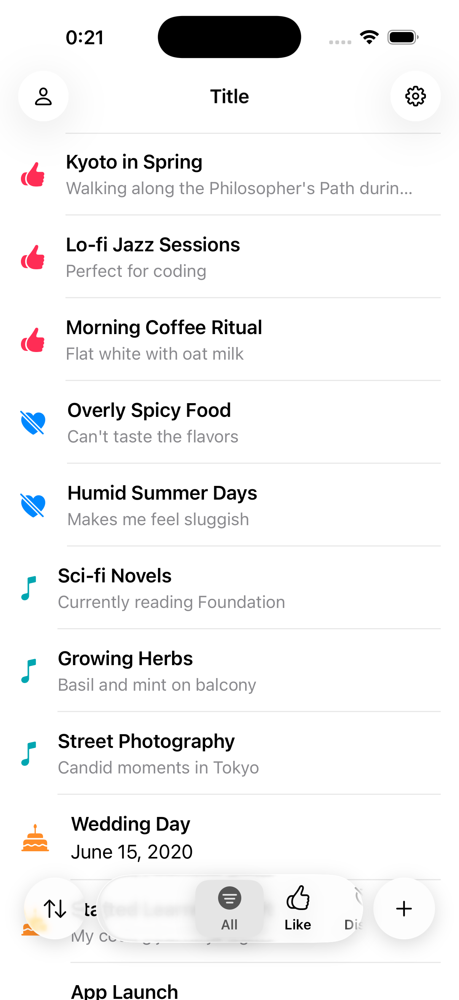
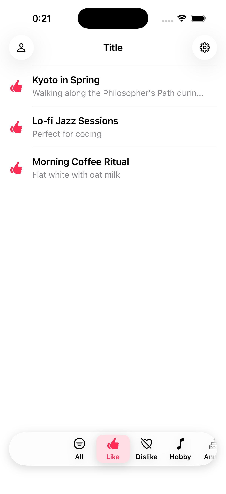
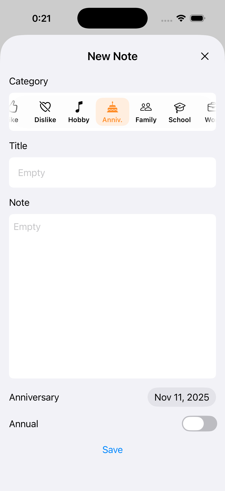
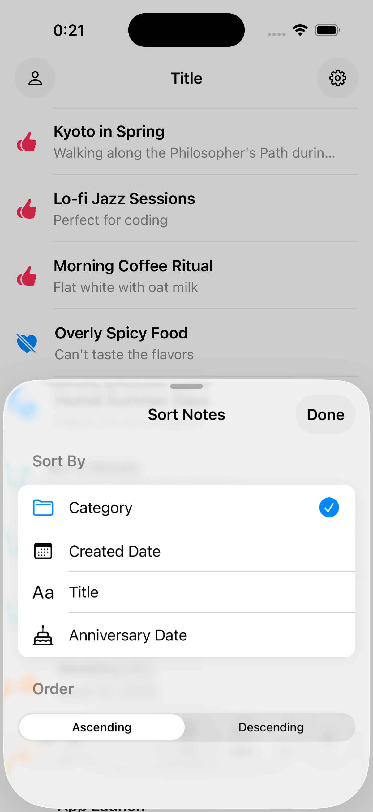
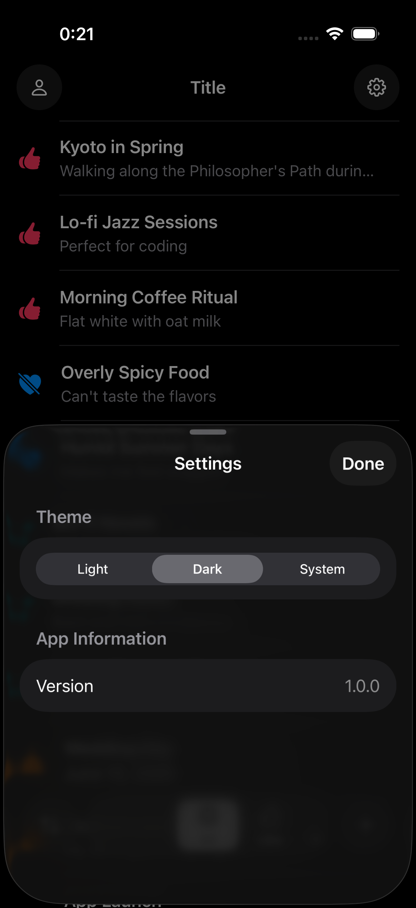

# SUKINOTE

A SwiftUI-based note-taking app for remembering everything about a person you care about. Keep track of their preferences, special dates, and important details organized by life categories.

## Screenshots

<p align="center">
  
  
  
</p>

<p align="center">
  
  
  
</p>

## Features

### Core Functionality

- **Category-based Organization**: Organize information about your loved ones into 7 categories (Like, Dislike, Hobby, Anniversary, Family, School, Work)
- **Filtering**: Filter notes by category using an intuitive horizontal dial selector
- **Sorting**: Sort notes by creation date, title, or category with ascending/descending order
- **Theme Support**: Switch between Light, Dark, and System themes

### User Interface

- **Liquid Glass**: Translucent glass-effect components following the latest Apple's design patterns
- **Custom Category Dial**: Horizontal scrollable category picker with snap behavior and haptic feedback
- **Sheet-based Navigation**: Bottom sheets for creating, editing, viewing, and managing notes
- **Smooth Animations**: Polished transitions and micro-interactions throughout the app

## Screens

### NoteListScreen
Main screen displaying all notes about your loved ones with filtering and sorting capabilities.
- Category filter dial at the bottom
- Floating action buttons for sorting and adding notes
- Swipe actions for editing and deleting notes
- Empty state display when no notes exist

### NoteDetailScreen
Read-only view of a single note showing full details about a person.
- Display title, content, category, and creation date
- Shows anniversary date if applicable
- Option to edit from detail view

### NoteEditScreen
Create or edit notes about people you care about with form validation.
- Text fields for title and content
- Category picker
- Optional anniversary date picker with annual toggle
- Save validation and user feedback

## Architecture

### Technology Stack
- **SwiftUI**: Declarative UI framework
- **SwiftData**: Persistent data storage with `@Model` macro
- **The Composable Architecture (TCA)**: State management and side effects
- **UIKit Integration**: Custom UIKit components via `UIViewRepresentable`

### Data Model

#### Note
```swift
@Model
final class Note: Identifiable, @unchecked Sendable {
    var id: UUID
    var createdAt: Date
    var category: NoteCategory
    var title: String
    var content: String
    var anniversaryDate: Date?
    var isAnnual: Bool?
}
```

#### NoteCategory
Seven predefined categories for organizing information about people:
- **Like**: Things they enjoy (👍)
- **Dislike**: Things they don't prefer (💔)
- **Hobby**: Their personal interests (🎵)
- **Anniversary**: Important dates (birthdays, anniversaries) (🎂)
- **Family**: Family-related information (👥)
- **School**: Academic notes (🎓)
- **Work**: Professional notes (💼)

## Requirements

- iOS 17.0+
- Xcode 15.0+
- Swift 6.0+

## Dependencies

- [swift-composable-architecture](https://github.com/pointfreeco/swift-composable-architecture) - State management
